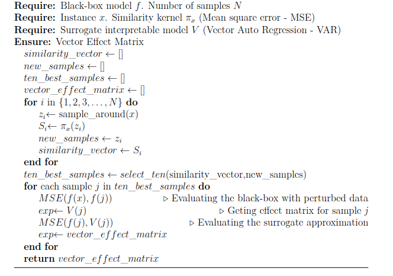
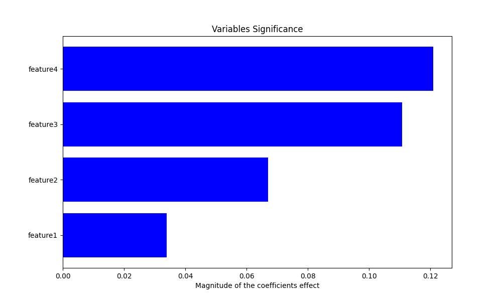
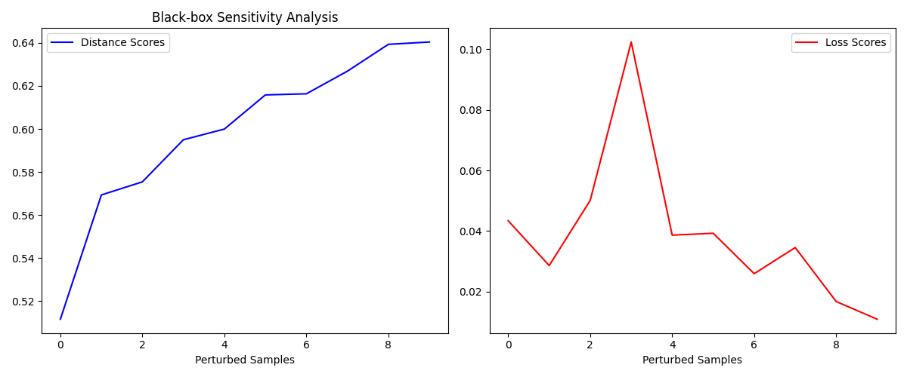
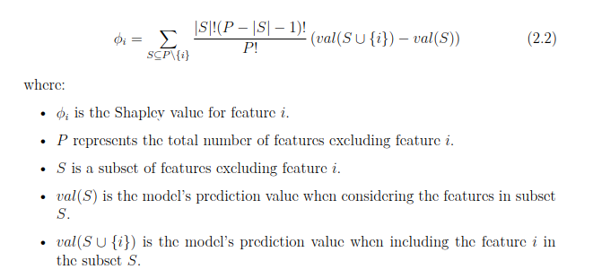
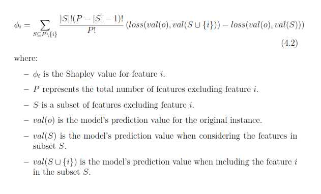
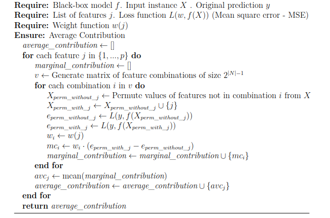
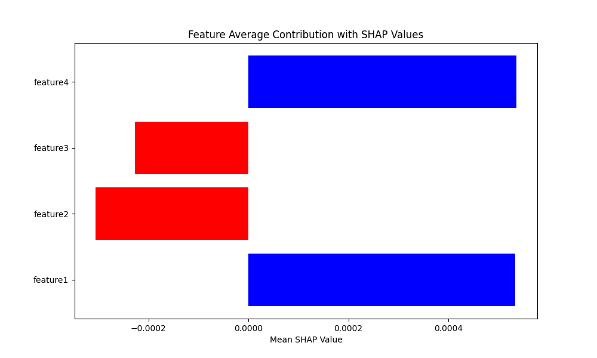

# Multivariate-Time-Series-Explainers

# Introduction
MTSexp stands for Multivariate Time Series explainers, a framework that contains interpretability methods for multivariate data, referred to here as explainers. The framework aims to provide local, post-hoc, and model-agnostic interpretation for black-box models that take 2D inputs (sample_size, num_features) and return 2D outputs. If the black-box doesn't fit this configuration, one can wrap the black-box prediction function into a class or function that appropriately converts the input data (e.g., 3D to 2D) before and after the prediction.

Here is an overview of the MTSexp explainers:

## Explainers

### 2.1 MTSexpLIME
MTSexpLIME is a model-agnostic and post-hoc method derived from the existing LIME framework. MTSexpLIME works with multivariate time series data. The main difference from the existing LIME is the use of a Vector Auto Regression model (VAR) as a surrogate model instead of the linear model (typically a weighted linear regression model) used in LIME. Here is the pseudocode for MTSexpLIME:

The result we get from the VAR model provides the contribution effects of each feature to the prediction, where a positive coefficient indicates a positive effect of the feature on the prediction, while a negative coefficient suggests an inverse relationship. The picture below displays the interpretation for a given input data where negative effects are in red and positive effects are in blue.

Furthermore, MTSexpLIME demonstrates the evaluation of the black-box model's predictions using perturbed samples, along with assessing how accurately the surrogate model approximates the black-box model on these perturbed samples derived from the original data (see the following pictures).

### 2.2 MTSexpSHAP
MTSexpSHAP is also a model-agnostic and post-hoc method derived from the existing SHAP framework. MTSexpSHAP works with multivariate time series data and relies on classic Shapley value estimation, as defined in the following equation:

However, to tackle the dimensionality issue that can arise when using the equation above, where the operation of \( val(S U \{i\}) - val(S) \) may not result in a single value as expected in the context of multivariate time series, MTSexpSHAP uses a modified version of the equation that fits multivariate settings:

This results in the following algorithm for MTSexpSHAP:

Lastly, MTSexpSHAP computes Shapley values, which measure the feature attribution for a given prediction. Like MTSexpLIME, a positive Shapley value indicates a positive influence on the prediction, and a negative Shapley value indicates a negative influence (see picture above).

