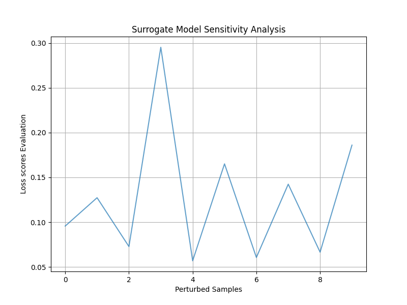

# Multivariate-Time-Series-Explainers

# Introduction
MTSexp stands for Multivariate Time Series explainers, a framework that contains interpretability methods for multivariate data, referred to here as explainers. The framework aims to provide local, post-hoc, and model-agnostic interpretation for black-box models that take 2D inputs (sample_size, num_features) and return 2D outputs. If the black-box doesn't fit this configuration, one can wrap the black-box prediction function into a class or function that appropriately converts the input data (e.g., 3D to 2D) before and after the prediction.

Here is an overview of the MTSexp explainers:

## Explainers

### 2.1 MTSexpLIME
MTSexpLIME is a model-agnostic and post-hoc method derived from the existing LIME framework. MTSexpLIME works with multivariate time series data. The main difference from the existing LIME is the use of a Vector Auto Regression model (VAR) as a surrogate model instead of the linear model (typically a weighted linear regression model) used in LIME. Here is the pseudocode for MTSexpLIME:

### Algorithm: IMT-LIME based on classic LIME

**Input:**
- Black-box model \( f \)
- Number of samples \( N \)
- Instance \( x \)
- Similarity kernel \( \pi_x \) (Mean square error - MSE)
- Surrogate interpretable model \( V \) (Vector Auto Regression - VAR)

**Output:**
- Vector Effect Matrix

**Algorithm:**
1. Initialize \( similarity\_vector \) as an empty list
2. Initialize \( new\_samples \) as an empty list
3. Initialize \( ten\_best\_samples \) as an empty list
4. Initialize \( vector\_effect\_matrix \) as an empty list

5. **for** each \( i \) in \( \{1, 2, 3, \ldots, N\} \) **do**
   - \( z_{i} \gets \text{sample\_around}(x) \)
   - \( S_{i} \gets \pi_x(z_{i}) \)
   - Add \( z_{i} \) to \( new\_samples \)
   - Add \( S_{i} \) to \( similarity\_vector \)

6. \( ten\_best\_samples \gets \text{select\_ten}(similarity\_vector, new\_samples) \)

7. **for** each sample \( j \) in \( ten\_best\_samples \) **do**
   - Evaluate \( MSE(f(x), f(j)) \) \(\triangleright\) Evaluating the black-box with perturbed data
   - \( exp \gets V(j) \) \(\triangleright\) Getting effect matrix for sample \( j \)
   - Evaluate \( MSE(f(j), V(j)) \) \(\triangleright\) Evaluating the surrogate approximation
   - Append \( exp \) to \( vector\_effect\_matrix \)

8. **return** \( vector\_effect\_matrix \)

The result we get from the VAR model provides the contribution effects of each feature to the prediction, where a positive coefficient indicates a positive effect of the feature on the prediction, while a negative coefficient suggests an inverse relationship. The picture below displays the interpretation for a given input data where negative effects are in red and positive effects are in blue.

Additionally, MTSexpLIME displays the evaluation of the black-box when predicting on 

### 2.2 MTSexpSHAP
MTSexpSHAP is also a model-agnostic and post-hoc method derived from the existing SHAP framework. MTSexpSHAP works with multivariate time series data and relies on classic Shapley value estimation, as defined in the following equation:

\begin{centering}
\begin{equation}\label{eq:1}
\phi_i = \sum_{S \subseteq P \backslash \{i\}} \frac{|S|!(P - |S| - 1)!}{P!} \left(val(S \cup \{i\}) - val(S) \right)
\end{equation}
\end{centering}

where:
- \( \phi_i \) is the Shapley value for feature \( i \).
- \( P \) represents the total number of features excluding feature \( i \).
- \( S \) is a subset of features excluding feature \( i \).
- \( val(S) \) is the model's prediction value when considering the features in subset \( S \).
- \( val(S \cup \{i\}) \) is the model's prediction value when including feature \( i \) in the subset \( S \).

However, to tackle the dimensionality issue that can arise when using the equation above, where the operation of \( val(S \cup \{i\}) - val(S) \) may not result in a single value as expected in the context of multivariate time series, MTSexpSHAP uses a modified version of the equation that fits multivariate settings:

\begin{centering}
\begin{equation}\label{eq:4}
\phi_i = \sum_{S \subseteq P \backslash \{i\}} \frac{|S|!(P - |S| - 1)!}{P!} \left(loss(val(o), val(S \cup \{i\})) - loss(val(o), val(S)) \right)
\end{equation}
\end{centering}

This results in the following algorithm for MTSexpSHAP:

\begin{algorithm}
\caption{IMT-SHAP based on classic Shapley values of game theory}\label{alg:shapley}
\begin{algorithmic}
\Require Black-box model $f$. Input instance $X$. Original prediction $y$
\Require List of features $j$. Loss function $L(w, f(X))$ (Mean square error - MSE)
\Require Weight function $w(j)$
\Ensure Average Contribution
\State $\textit{average\_contribution} \gets []$
\For{each feature $j$ in $\{1, ..., p\}$}
    \State $\textit{marginal\_contribution} \gets []$
    \State $v \gets \text{Generate matrix of feature combinations of size } 2^{|N|-1}$
    \For{each combination $i$ in $v$}
        \State $X_{perm\_without\_j} \gets \text{Permute values of features not in combination } i \text{ from } X$
        \State $X_{perm\_with\_j} \gets X_{perm\_without\_j} \cup \{j\}$
        \State $e_{perm\_without\_j} \gets L(y, f(X_{perm\_without\_j}))$
        \State $e_{perm\_with\_j} \gets L(y, f(X_{perm\_with\_j}))$
        \State $w_i \gets w(j)$
        \State $mc_i \gets w_i \cdot (e_{perm\_with\_j} - e_{perm\_without\_j})$
        \State $\textit{marginal\_contribution} \gets \textit{marginal\_contribution} \cup \{mc_i\}$
    \EndFor
    \State $avc_j \gets \text{mean}(\textit{marginal\_contribution})$
    \State $\textit{average\_contribution} \gets \textit{average\_contribution} \cup \{avc_j\}$
\EndFor
\State \textbf{return} $\textit{average\_contribution}$
\end{algorithmic}
\end{algorithm}

Lastly, MTSexpSHAP computes Shapley values, which measure the feature attribution for a given prediction. Like MTSexpLIME, a positive Shapley value indicates a positive influence on the prediction, and a negative Shapley value indicates a negative influence (see picture above).

— picture here —

